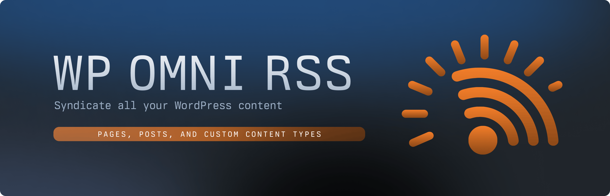

# WP Omni RSS



Transform your WordPress RSS feed into a powerful content distribution channel. Get more control over what content appears in your feed and how it's presented.

## 🤔 What is WP Omni RSS?

WP Omni RSS enhances your WordPress RSS feed by adding features that standard WordPress RSS doesn't provide:
- Include any content type (posts, pages, products, etc.)
- Track and display content changes
- Add custom meta information
- Control excerpt length
- Add content type prefixes to titles

Perfect for:
- Content publishers who want better RSS feeds
- Developers integrating WordPress content into other platforms
- Teams using RSS for content syndication

## 🚀 Inspiration

This plugin was inspired by Adam Newbold's essay ["Everything is a Web Page"](https://notes.neatnik.net/2025/01/everything-is-a-web-page), which argues that the distinction between static pages and blog posts is merely a mental model. All web content can be treated as syndication-worthy pages. WP Omni RSS brings this vision to WordPress by allowing you to include any content type in your RSS feed.

## 🚀 Quick Start

1. Install the plugin through WordPress admin or upload to `/wp-content/plugins/`
2. Activate the plugin
3. Go to Settings > WP Omni RSS
4. Choose which content types to include in your feed
5. Visit `yourdomain.com/feed` to see your enhanced RSS feed

## 📚 Core Concepts

WP Omni RSS works by extending WordPress's built-in RSS functionality in three key ways:
1. **Content Selection**: Choose exactly which content types appear in your feed
2. **Change Tracking**: Add notes about what changed in each update
3. **Meta Information**: Include additional context with each item

## 💡 Common Use Cases

### Adding Content Types to Your Feed
1. Go to Settings > WP Omni RSS
2. Check the boxes for content types you want to include
3. Save changes

### Tracking Content Changes
1. Edit any post or page
2. Find the "RSS Change Tracking" box
3. Add notes about what changed
4. Update your content

### Adding Custom Meta Information
1. Edit your content
2. Locate the "Additional Meta Information" field
3. Add your custom notes or references
4. Update to see it in your feed

## 📖 Settings Reference

### General Settings
- **Content Types**: Choose which types appear in feed
- **Prefix Type**: How content types are shown in titles
- **Excerpt Length**: Number of words (0 for full content)
- **Change Tracking**: Enable/disable change notes

### Post Meta Fields
- **Change Description**: What changed in this update
- **Additional Meta**: Extra information to include

## 🔧 Developer Guide

### Filters
```php
// Modify feed content
add_filter('wp_omni_rss_content', 'your_function');

// Adjust feed settings
add_filter('wp_omni_rss_settings', 'your_function');
```

### Actions
```php
// Before feed generation
do_action('wp_omni_rss_before_feed');

// After feed generation
do_action('wp_omni_rss_after_feed');
```

## ❓ Troubleshooting

### Feed Not Updating?
1. Clear your WordPress cache
2. Verify your feed URL is correct
3. Check if selected content types have published items

### Missing Content Types?
1. Ensure content types are public
2. Verify they're selected in settings
3. Check user permissions

### Need Help?
- Open an issue on GitHub
- Check our documentation
- Contact support

## 📄 License

MIT License

---
Made with ❤️ by [Ashraf Ali](https://ashrafali.net)